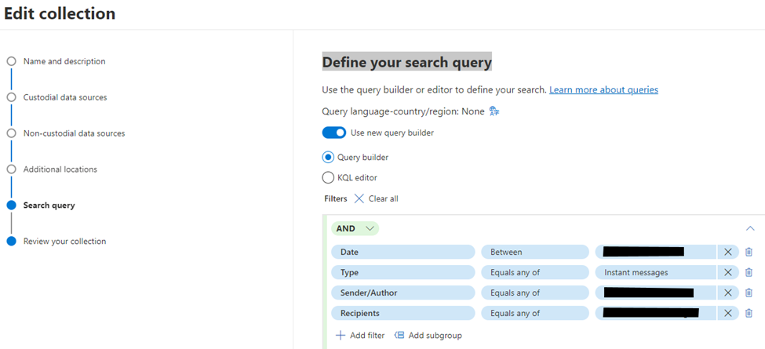
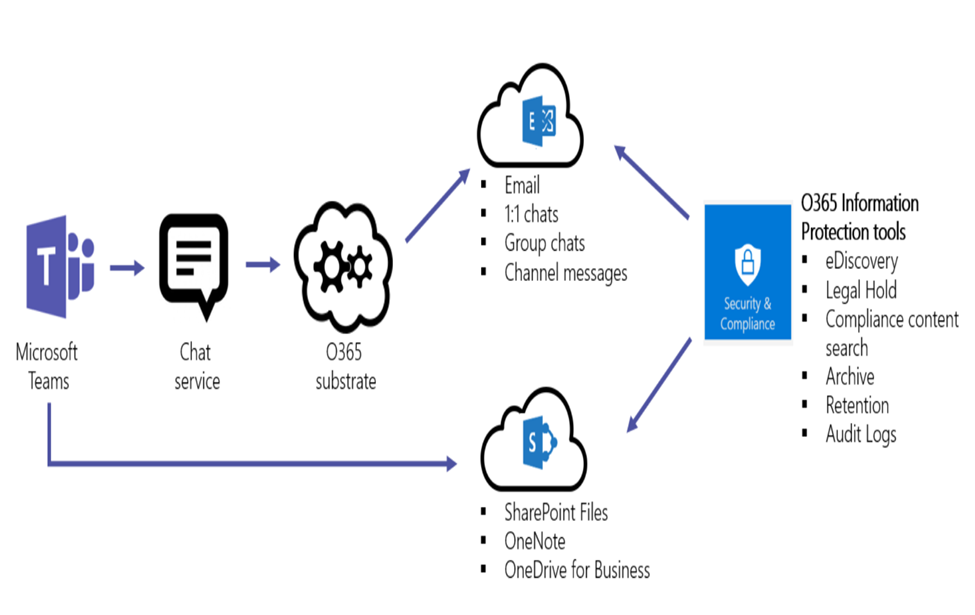
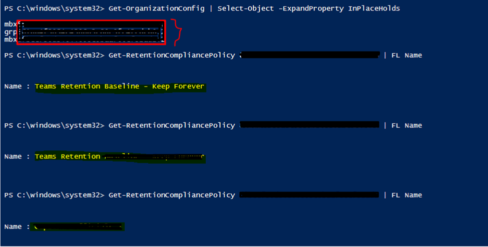
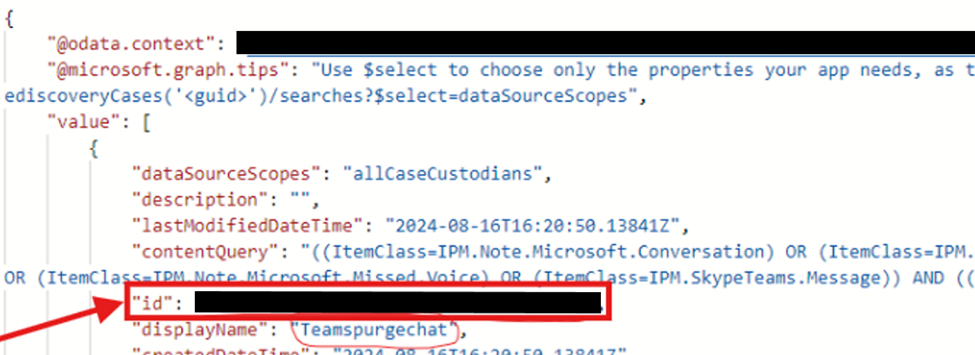
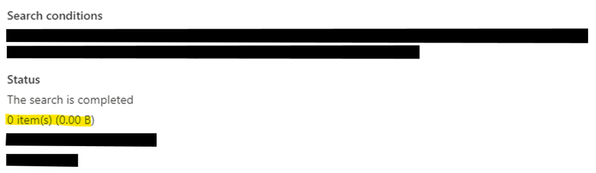

# Search for and Delete Chat Messages in Teams
*auther: Kas Tsaedu*

## Overview
This guide primarily outlines the process for searching for and deleting chat messages in Teams using eDiscovery (Premium) and the Microsoft Graph Explorer. I developed this draft due to the numerous discrepancies and inconsistencies found in the official Microsoft documentation titled “Search for and delete chat messages in Teams” While attempting to follow this document in my job, I discovered significant errors and a lack of clarity in the official Microsoft KBA. This motivated me to write a clearer and more user-friendly set of instructions. Administrators can use this guide to find and remove sensitive or inappropriate content or to respond to data spillage incidents where confidential or malicious information has been released through Teams chat messages in Microsoft 365.


## Prerequisites
Minimum Admin role required to complete the task:
* eDiscovery Manager: To create an eDiscovery (Premium) case and use collections to search for chat messages
* Search and purge: To run the purge (To delete chat messages)
* Graph: API Permission to eDiscovery.Read.All and eDiscovery.ReadWrite.All permissions: To complete the purge process in Graph Explorer or PowerShell 


## Steps to Search and delete 


## Step 1: Create a Case in eDiscovery (Premium)

1. Go to [Microsoft Compliance Center](https://compliance.microsoft.com) and sign in.
2. Select **eDiscovery > Premium**.
3. Go to the **Cases** tab and click on **Create a case**.
4. On the **Name and description** page, provide a name and description for your case.
5. Select the **New (recommended)** option and then click **Next**.

## Step 2: Create a Collection Estimate

1. Navigate to the **Cases** tab in eDiscovery (Premium) and select the case you created.
2. Go to the **Data Sources** tab and click **Add Data Source**.
   - Specify the data source: Add new custodians by searching for the custodians’ UPN/user or group, or import if you have a CSV or another file list.
3. Go to the **Collections** tab and click **New collection**.
   - Provide a name and description. Note that after the collection is created, you can't change the name, but you can modify the description.
4. On the **Custodial data sources** page:
   - Select the **Select all** toggle to search all custodians added to the case. This option searches all data sources for all custodians.
   - If you need to search only specific custodians, click on **Select custodians** to display the list of case custodians and select one or more custodians.
5. (Optional) On the **Non-custodial data sources** page, select one of the following options to identify the non-custodial data sources to collect content from:
   - Select **Select non-custodial data sources** to choose specific non-custodial data sources added to the case.
   - Select the **Select all** toggle to choose all non-custodial data sources added to the case.
6. Click **Next**.
7. On the **Additional locations** page, you can select other mailboxes and sites to search as part of the collection.
8. On the **Search Query** page, define your search query as required.



**Notes** Administrators can add multiple collections as required.
- For searching for chat messages: use the **Type** condition and select the **Instant messages** option when building the search query for the collection estimate.
- Adding a date range or several keywords to narrow the scope of the collection to items relevant to your search and delete investigation is recommended.

## Step 3: Review and Verify Chat Messages to Delete

1. Review a sample of items in a collection estimate to confirm if there is data available in the collection and if the data is the target information you are looking to purge.
2. Additionally, you can use the collection statistics (specifically the **Top Locations** statistics) to generate a list of the data sources that contain items returned by the collection. Use this list in the next step to remove hold and retention policies from the data sources that contain search results. For more information, see Collection statistics and reports.

The following figure indicates the ingestion flow of Teams data to both Exchange and SharePoint for Teams Files and Messages. Target the correct data location path accordingly.




 ## Step 4: Remove All Holds and Retention Policies from Data Sources

Before deleting chat messages from a mailbox, administrators might need to review and obtain organizational approval to remove all organization-wide holds, site holds, or retention policies for the targeted mailboxes. If these are not removed, the chat messages intended for deletion will be retained. Note that removing retention policies and holds carries a risk of further data loss during that time frame, as users may have the capability to delete items.

Once the main data source locations are identified, determine the organization-wide hold and retention assigned to the specific data source. For example, for 1:1 chat, the data source location path might look like this: `Primary, <GUID>\<username>(Primary)\TeamsMessagesData`. This indicates the need to remove the user from the Teams retention policy assigned for Teams chat. For group chats, such as 1-to-many or channel chats, you might need to remove the users from other retention policies like retention for channels.

> **Note:** Be sure to write down these settings or save them to a text file because you'll need to revert these properties to their original values in Step 6, after deleting items from the Recoverable Items folder.

Here is a list of mailbox properties you might need to collect for the identified data location/path:

- **LitigationHoldEnabled**
- **InPlaceHolds**
- **DelayHoldApplied**
- **DelayReleaseHoldApplied**
- **RetentionHoldEnabled**

```powershell
#  Example command to check for any hold or organization wide retention

Get-Mailbox <username> | FL SingleItemRecoveryEnabled,RetainDeletedItemsFor
Get-Mailbox <username> | FL *hold*
Get-mailbox <username> | fl userp*, guid, inp*, ret*, lit*, sing*, delay*, elc*, *quo*


```

If all these settings are `False`, no action is required. If any of these holds are enabled (`True`) and block the purging process, you will need to disable them. For example, if the deleted item retention period isn't set for 30 days (the maximum value in Exchange Online), you can increase it.

You can run the following command to disable the hold assigned to the affected user:

```powershell
# Example command to disable a hold
Set-Mailbox -Identity <UserIdentity> -LitigationHoldEnabled $false
Set-Mailbox <username> -SingleItemRecoveryEnabled $false #To enable single item recovery:
Set-Mailbox <username> -RetainDeletedItemsFor 30       #To increase the deleted item retention period (This assumes that the current setting is less than 30 days) #
Set-Mailbox <username> -RemoveDelayHoldApplied           #To remove the delay hold #
Set-Mailbox <username> -RemoveDelayReleaseHoldApplied         #To remove the delay release hold #

```

Run the following command to get information about any organization-wide retention policies:

```powershell
# Command to identify In-Place Hold
Get-Mailbox -Identity <UserIdentity> | FL InPlaceHolds
Get-OrganizationConfig | Select-Object -ExpandProperty InPlaceHolds
Get-organizationconfig | fl OrganizationId, name, guid, InPlaceHolds, ElcProcessingDisabled

```

Run the following command in Exchange Online PowerShell to identify the In-Place Hold placed on the mailbox. Use the GUID for the In-Place Hold that you identified:

```powershell
Command to get retention policies
Get-RetentionCompliancePolicy -Identity <retention policy GUID without prefix> | FL Name
```



After identifying the retention policy, go to the **Data lifecycle management > Microsoft 365 > Retention page** in the compliance portal. Edit the retention policy identified in the previous step and remove the mailbox from the list of recipients included in the retention policy.

If a mailbox is excluded from an organization-wide Microsoft Purview retention policy, the GUID for the retention policy that the mailbox is excluded from is displayed in the **InPlaceHolds** property and is identified by the `-mbx` prefix.

```powershell
Get-Mailbox <username> | FL InPlaceHolds

```
Check the InPlaceHolds property and ensure the prefix shows empty or (`-MBX`).


## Step 5: Delete Chat Messages from Teams
- We can use one of the following two options to perform the purge request.

### Option One: Microsoft Graph Explorer

To complete the purge process in Graph Explorer, you may need to consent to the correct Graph Explorer permissions. We will use a PowerShell script and Microsoft Graph Explorer to perform the following three tasks:

1. Get the ID of the eDiscovery (Premium) case created in Step 1. This is the case that contains the collection created in Step 2.
2. Get the ID of the collection created in Step 2 and verified in Step 3. The search query in this collection returns the chat messages to be deleted.
3. Delete the chat messages returned by the collection.

### Steps

1. **Get the ID of the eDiscovery (Premium) case (eDiscoveryCaseId or Id) created in Step 1.**
   - Go to Microsoft Graph Explorer and sign in with an account assigned the Search And Purge role in the Microsoft Purview compliance portal.
   - Run the following GET request to retrieve the ID for the eDiscovery (Premium) case:
     ```plaintext
     https://graph.microsoft.com/v1.0/security/cases/ediscoveryCases
     ```
     Be sure to select `v1.0` in the API version dropdown list.

   - This request returns information about all cases in your organization on the Response preview tab.
   - Scroll through the response to locate the eDiscovery (Premium) case. Use the `displayName` property to identify the case.
   - Copy the corresponding ID (or copy and paste it to a text file). You'll use this ID in the next task to get the collection ID.

     > **Tip:** Alternatively, to obtain the case `ID`, you can open the case in the Microsoft Purview compliance portal and copy the case ID from the URL. 

2. **Get the eDiscovery Search ID (SearchId).**
   - In Graph Explorer, run the following `GET` request to retrieve the `ID` for the collection created in Step 2, which contains the items you want to delete:
     ```plaintext
     https://graph.microsoft.com/v1.0/security/cases/ediscoveryCases/{ediscoveryCaseID}/searches
     ```
     where `{ediscoveryCaseID}` is the CaseID obtained in the previous procedure.

   - Scroll through the response to locate the collection containing the items you want to delete. Use the `displayName` property to identify the collection created in Step 3.
   - In the response, the search query from the collection is displayed in the `contentQuery` property. Items returned by this query will be deleted in the next task.
   - Copy the corresponding `ID` (or copy and paste it to a text file). You'll use this ID in the next task to delete the chat messages.


  


### Delete the Chat Messages with Graph API

1. In Graph Explorer, run the following `POST` request to delete the items returned by the collection created in Step 2.
2. Use the value `https://graph.microsoft.com/v1.0/security/cases/ediscoveryCases/{ediscoveryCaseID}/searches/{ediscoverySearchID}/purgeData` in the address bar of the request query, where `{ediscoveryCaseID}` and `{ediscoverySearchID}` are the IDs obtained in the previous procedures.
3. If the POST request is successful, an HTTP response code: 200 will be displayed in a green banner stating that the request was accepted. For more information on purge data, see sourceCollection: purgeData.

### Option Two: Delete Chat Messages with PowerShell

You can also delete chat messages using PowerShell. For example, to delete messages in the US Government cloud, you could use a command similar to the one below, but you need to specify the environment as `USGov`. For commercial tenants, you don't need to specify the environment.

```powershell
# Example command to delete messages in the US Government cloud/GCC/
Connect-MgGraph -Scopes "ediscovery.ReadWrite.All" -Environment USGov
Use the:  Connect-MgGraph -Scopes "ediscovery.ReadWrite.All"   #without specifying the environment if you are not able to connect with the environment specified (commerial tenant).
#Run the following to check the search collection"
Invoke-MgGraphRequest -Method Get -Uri '/v1.0/security/cases/ediscoveryCases/{`ediscoveryCaseID`}/searches/{ediscoverySearchID}'
# Run the following to delete chat messages
Invoke-MgGraphRequest -Method POST -Uri '/v1.0/security/cases/ediscoveryCases/*<ediscoveryCaseID>*/searches/<search ID>/purgeData'


```

A maximum of 10 items per mailbox are deleted when you run the previous command. For multiple items (more than 10), you need to rerun the script at different time intervals.


## Step 6: Verify Chat Messages are Deleted
After running the POST request to delete chat messages, these messages are removed from the Teams client and replaced with an automatically generated message stating “This message was deleted by an admin”. Admins can confirm with end users if the original chat messages are replaced by the auto-generated messages.

Alternatively, administrators can rerun the content search and verify if any matching messages are found.




Deleted chat messages are moved to the Substrate Holds folder, which is a hidden mailbox folder. Deleted chat messages are stored there for at least 1 day, and then are permanently deleted the next time the timer job runs (typically between 1-7 days).

Note: SingleItemRecoveryEnabled can be switched to True by itself (broken by design) after running the purge request. You might need to recheck after running the purge request in Step 5 if items are not purged successfully.

## Step 7: Reapply Holds and Retention Policies to Data Sources

After verifying that chat messages are deleted and removed from the Teams client, reapply the holds and retention policies that were removed in Step 4.

`*Note*`: End users have the capability to purge items during the window after removing the hold and retentions (Step 4) and before reapplying the hold (Step 7). Reapplying the holds and retention policies removed in Step 4 as soon as the purge is verified is crucial to minimize the risk of losing data.

Example: If SingleItemRecovery was disabled in Step 4, reapply the hold by running the following script:

```powershell
Set-Mailbox <username> -SingleItemRecoveryEnabled $True

```
Follow the same process to reapply all removed holds/retention policies.

Remove users from the Teams retention exclusion (if any): After the users are removed from the Teams retention exception, they are now subject to the organization-wide retention policy.


Follow the same process and reapply ALL the holds and retention policies that we removed in the earlier Step 4

## Conclusion
This guide provides a streamlined process for searching and deleting chat messages in Teams, addressing the gaps and errors in the official documentation. By following these steps, administrators can effectively manage sensitive or inappropriate content in Teams.

## Contributions
Feel free to contribute to this guide by submitting a pull request or opening an issue.


## Reference
[Search for and delete chat messages in Teams | Microsoft Learn](https://learn.microsoft.com/en-us/purview/ediscovery-search-and-delete-teams-chat-messages) 
[Learn about retention for Teams | Microsoft Learn](https://learn.microsoft.com/en-us/purview/retention-policies-teams)  
[Delete items in the Recoverable Items folder | Microsoft Learn](https://learn.microsoft.com/en-us/purview/ediscovery-delete-items-in-the-recoverable-items-folder-of-mailboxes-on-hold#step-5-delete-items-in-the-recoverable-items-folder)
 


# Knowledge Base Article

We appreciate your feedback! Feel free to leave comments or suggestions by using the link above.

Thank you for reading!
